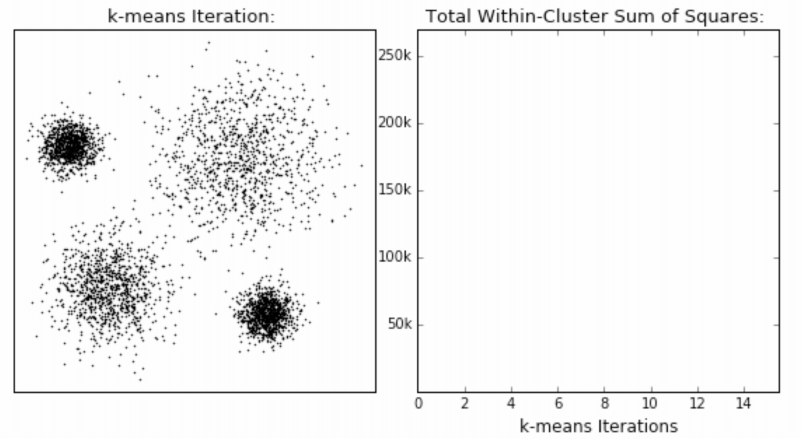

# 6.4 模型评估

## 学习目标

- 知道模型评估中的SSE、“肘”部法、SC系数和CH系数的实现原理

------

## 1 误差平方和

误差平方和(SSE \The sum of squares due to error)具体概念通过如下举例介绍：

举例:

(下图中数据-0.2, 0.4, -0.8, 1.3, -0.7, 均为真实值和预测值的差)

在k-means中的应用:

公式各部分内容:

上图中: k=2

- **SSE图最终的结果,对图松散度的衡量.**(eg: **SSE(左图)<SSE(右图)**)

 

- SSE随着聚类迭代,其值会越来越小,直到最后趋于稳定:

- 如果质心的初始值选择不好,SSE只会达到一个不怎么好的局部最优解.

## 2 “肘”方法 

“肘”方法 (Elbow method) 主要是用于确定聚类算法中的K值，具体流程如下：

（1）对于n个点的数据集，迭代计算k from 1 to n，每次聚类完成后计算每个点到其所属的簇中心的距离的平方和；

（2）平方和是会逐渐变小的，直到k==n时平方和为0，因为每个点都是它所在的簇中心本身。

（3）在这个平方和变化过程中，会出现一个拐点也即“肘”点，**下降率突然变缓时即认为是最佳的k值**。

在决定什么时候停止训练时，肘形判据同样有效，数据通常有更多的噪音，在**增加分类无法带来更多回报时，我们停止增加类别**。

## 3 轮廓系数法

轮廓系数法（Silhouette Coefficient）结合了聚类的凝聚度（Cohesion）和分离度（Separation），用于评估聚类的效果：

**目的：**

​	内部距离最小化，外部距离最大化

计算样本i到同簇其他样本的平均距离ai，ai 越小样本i的簇内不相似度越小，说明样本i越应该被聚类到该簇。

计算样本i到最近簇Cj 的所有样本的平均距离bij，称样本i与最近簇Cj 的不相似度，定义为样本i的簇间不相似度：bi =min{bi1, bi2, ..., bik}，bi越大，说明样本i越不属于其他簇。

求出所有样本的轮廓系数后再求平均值就得到了**平均轮廓系数**。

平均轮廓系数的取值范围为[-1,1]，系数越大，聚类效果越好。

簇内样本的距离越近，簇间样本距离越远

**案例：**

下图是500个样本含有2个feature的数据分布情况，我们对它进行SC系数效果衡量：

**n_clusters = 2 The average silhouette_score is : 0.7049787496083262**

n_clusters = 3 The average silhouette_score is : 0.5882004012129721

**n_clusters = 4 The average silhouette_score is : 0.6505186632729437**

n_clusters = 5 The average silhouette_score is : 0.56376469026194

n_clusters = 6 The average silhouette_score is : 0.4504666294372765

n_clusters 分别为 2，3，4，5，6时，SC系数如下，是介于[-1,1]之间的度量指标：

**每次聚类后，每个样本都会得到一个轮廓系数，当它为1时，说明这个点与周围簇距离较远，结果非常好，当它为0，说明这个点可能处在两个簇的边界上，当值为负时，暗含该点可能被误分了。**

从平均SC系数结果来看，K取3，5，6是不好的，那么2和4呢？

k=2的情况：

k=4的情况：

n_clusters = 2时，第0簇的宽度远宽于第1簇；

n_clusters = 4时，所聚的簇宽度相差不大，因此选择K=4，作为最终聚类个数。

## 4 CH系数

CH系数（Calinski-Harabasz Index）追求的是：**类别内部数据的协方差越小越好，类别之间的协方差越大越好**（换句话说：类别内部数据的距离平方和越小越好，类别之间的距离平方和越大越好）。

这样的Calinski-Harabasz分数s会高，分数s高则聚类效果越好。

> tr为**矩阵的迹**, Bk为类别之间的协方差矩阵，Wk为类别内部数据的协方差矩阵;

> m为训练集样本数，k为类别数。

------

使用矩阵的迹进行求解的理解：

矩阵的对角线可以表示一个物体的相似性

在机器学习里，主要为了获取数据的特征值，那么就是说，在任何一个矩阵计算出来之后，都可以简单化，只要获取矩阵的迹，就可以表示这一块数据的最重要的特征了，这样就可以把很多无关紧要的数据删除掉，达到简化数据，提高处理速度。

CH需要达到的目的：

​	**用尽量少的类别聚类尽量多的样本，同时获得较好的聚类效果。**

------

## 5 小结

- sse【知道】
    - 误差平方和的值越小越好
- 肘部法【知道】
    - 下降率突然变缓时即认为是最佳的k值
- SC系数【知道】
    - 取值为[-1, 1]，其值越大越好
- CH系数【知道】
    - 分数s高则聚类效果越好
    - CH需要达到的目的：**用尽量少的类别聚类尽量多的样本，同时获得较好的聚类效果。**